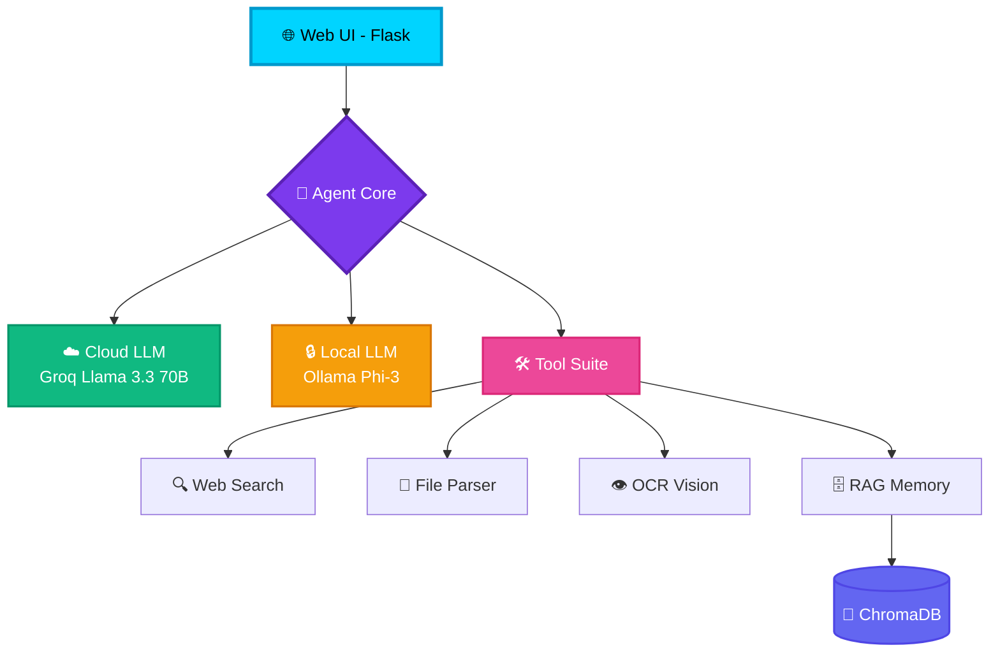
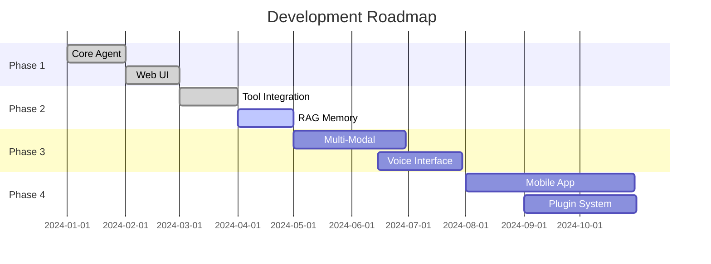

---
title: Openagent
emoji: 🤖
colorFrom: purple
colorTo: blue
sdk: docker
pinned: false
---
<div align="center">

<!-- Animated Banner -->


<!-- Badges with Animation Effect -->
<p align="center">
  
  
  
  
</p>

<!-- Animated Divider -->


<!-- Developer Badge -->
<p align="center">
  <a href="https://koushikhy.netlify.app">
    
  </a>
</p>

</div>

---

## 🌟 **What is OpenAgent?**

<div align="center">

```ascii
╔═══════════════════════════════════════════════════════════════╗
║                                                               ║
║   🧠 HYBRID AI AGENT - Best of Both Worlds                   ║
║                                                               ║
║   ⚡ ONLINE  → Groq Llama 3.3 70B (ChatGPT-level, FREE)     ║
║   🔒 OFFLINE → Ollama Phi-3 (Privacy + Local Processing)     ║
║   🎯 AUTO    → Intelligent Switching Based on Connectivity   ║
║                                                               ║
╚═══════════════════════════════════════════════════════════════╝
```

</div>

> A **next-generation AI assistant** that combines the **privacy of local processing** with the **power of cloud intelligence**. Never compromise between speed and security again!

---

## ✨ **Key Highlights**

<table>
<tr>
<td width="50%">

### 🎨 **Stunning Cyberpunk UI**
- ⚡ **Particle Animations** - Dynamic background effects
- 📺 **CRT Scanlines** - Retro-futuristic aesthetic  
- 🌈 **Glassmorphism** - Modern blur effects
- 🎭 **Real-Time Status** - Visual mode indicators
- 📤 **Drag & Drop** - Seamless file uploads

</td>
<td width="50%">

### 🛠️ **Powerful Toolset**
- 🌐 **Web Search & Fetch** - Real-time internet access
- 📄 **File Parser** - PDF, DOCX, TXT extraction
- 👁️ **OCR Vision** - Image text recognition
- 🧠 **RAG Memory** - Conversation history
- ⚙️ **Sandbox Exec** - Safe command execution

</td>
</tr>
</table>

---

## 🚀 **Quick Start**

<details open>
<summary><b>📋 Prerequisites</b></summary>

<br>

```bash
✅ Python 3.10 or higher
✅ Ollama (for local AI models)
✅ Tesseract OCR (for image processing)
```

</details>

<details open>
<summary><b>🔑 API Setup (FREE — No Credit Card Needed)</b></summary>

<br>

> **OpenAgent uses [Groq](https://groq.com) for high-quality AI responses. Groq is 100% FREE — no credit card required!**

**Step 3: Get Your Free Groq API Key**

1. Go to **[https://console.groq.com](https://console.groq.com)**
2. Sign up with Google or email (no payment info needed)
3. Navigate to **API Keys** → Click **Create API Key**
4. Copy the key (starts with `gsk_...`)

**Step 4: Paste Your API Key**

Open `config/settings.yaml` and paste your key:

```yaml
llm:
  provider: "groq"               # Uses Groq's free API
  api_key: "gsk_YOUR_API_KEY_HERE"  # ← Paste your key here
  base_url: "https://api.groq.com/openai/v1"
  cloud_model: "llama-3.3-70b-versatile"
  
  # Offline Fallback (uses local Ollama when no internet)
  host: "http://localhost:11434"
  model: "phi3:mini"
```

> ⚠️ **Never commit your API key to public repos!** Add `config/settings.yaml` to `.gitignore` for public projects.

</details>

<details open>
<summary><b>🎯 Launch the Agent</b></summary>

<br>

```bash
python ui/server.py
```

**🌐 Open your browser:** [`http://localhost:5000`](http://localhost:5000)

</details>

---

## 🏗️ **System Architecture**

<div align="center">



</div>

---

## 🎯 **Core Features**

<div align="center">

| 🔧 Tool | 🌍 Type | 📝 Description |
|:---|:---:|:---|
| **Web Search** | 🌐 Online | DuckDuckGo-powered intelligent search |
| **Web Fetch** | 🌐 Online | Extract and parse website content |
| **File Parser** | 🔒 Local | PDF, DOCX, TXT text extraction |
| **OCR Vision** | 🔒 Local | Tesseract-based image text recognition |
| **Summarizer** | 🔒 Local | Condense long documents intelligently |
| **Sandbox Exec** | 🔒 Local | Secure shell command execution |
| **RAG Memory** | 🔒 Local | ChromaDB-powered conversation memory |

</div>

---

## ⚙️ **Configuration**

Edit `config/settings.yaml` to customize your experience:

```yaml
llm:
  # Primary Provider (FREE)
  provider: "groq"                         # Groq = free, fast, high quality
  api_key: "gsk_YOUR_API_KEY_HERE"          # Get free at https://console.groq.com
  base_url: "https://api.groq.com/openai/v1"
  cloud_model: "llama-3.3-70b-versatile"   # 70B model — ChatGPT-level quality
  
  # Local Fallback (when offline)
  host: "http://localhost:11434"
  model: "phi3:mini"                       # 3.8B model — runs on CPU
  
  # Tuning
  timeout_seconds: 60
  max_tokens: 2048
  temperature: 0.7
```

> 💡 **How it works:** OpenAgent auto-detects your internet connection in 2 seconds. Online → uses Groq (fast, smart). Offline → uses Ollama (private, local).

---

## 🎨 **UI Preview**

<div align="center">

<!-- Screenshot Placeholder - Replace with your actual screenshot -->


### ✨ **Features Showcase**

<table>
<tr>
<td align="center" width="33%">

<br><b>Particle Effects</b>
<br><sub>Dynamic Background</sub>
</td>
<td align="center" width="33%">

<br><b>Real-Time Chat</b>
<br><sub>Instant Responses</sub>
</td>
<td align="center" width="33%">

<br><b>File Upload</b>
<br><sub>Drag & Drop</sub>
</td>
</tr>
</table>

</div>

---

## 🔄 **How Hybrid Mode Works**

<div align="center">

┌─────────────────────────────────────────────────────────┐
│                    USER QUERY                           │
└──────────────────┬──────────────────────────────────────┘
                   │
                   ▼
        ┌──────────────────────┐
        │  Connectivity Check  │
        │   (2 sec ping)       │
        └──────────┬───────────┘
                   │
         ┌─────────┴─────────┐
         │                   │
         ▼                   ▼
┌─────────────────┐  ┌─────────────────┐
│  ONLINE MODE    │  │  OFFLINE MODE   │
│  ☁️ Groq API    │  │  🔒 Ollama      │
│  • Llama 70B    │  │  • Phi-3 Mini   │
│  • Web Search   │  │  • Privacy      │
│  • ChatGPT-lvl  │  │  • Fast & Safe  │
│  • FREE ✅      │  │  • No Internet  │
└─────────────────┘  └─────────────────┘
```

</div>

---

## 📊 **Performance Stats**

<div align="center">

| Metric | Online Mode | Offline Mode | Hybrid Mode |
|:---|:---:|:---:|:---:|
| **Response Time** | ~2-3s | ~1-2s | ~1-3s |
| **Privacy Level** | ⭐⭐⭐ | ⭐⭐⭐⭐⭐ | ⭐⭐⭐⭐ |
| **Capability** | ⭐⭐⭐⭐⭐ | ⭐⭐⭐ | ⭐⭐⭐⭐⭐ |
| **Uptime** | 95% | 100% | 100% |

</div>

---

## 🛣️ **Roadmap**

<div align="center">



</div>

---

## 🤝 **Contributing**

<div align="center">

We welcome contributions! Here's how you can help:

<table>
<tr>
<td align="center" width="25%">

<br><b>Report Bugs</b>
<br><sub>Open an issue</sub>
</td>
<td align="center" width="25%">

<br><b>Suggest Features</b>
<br><sub>Share your ideas</sub>
</td>
<td align="center" width="25%">

<br><b>Submit PRs</b>
<br><sub>Contribute code</sub>
</td>
<td align="center" width="25%">

<br><b>Improve Docs</b>
<br><sub>Help others</sub>
</td>
</tr>
</table>

</div>

---

## 👨‍💻 **About the Developer**

<div align="center">


### **Koushik HY**

[](https://koushikhy.netlify.app)
[](mailto:koushik4475@gmail.com)
[](https://github.com/koushik4475)

</div>

---

## 📜 **License**

<div align="center">

```ascii
╔═══════════════════════════════════════════════╗
║                                               ║
║   MIT License - Free to Use and Modify        ║
║   Copyright (c) 2024 Koushik HY              ║
║                                               ║
╚═══════════════════════════════════════════════╝
```

This project is licensed under the MIT License - see the [LICENSE](LICENSE) file for details.

</div>

---

## ⭐ **Star History**

<div align="center">

[](https://star-history.com/#koushik4475/open-agent&Date)

</div>

---

## 💝 **Support the Project**

<div align="center">

If you find OpenAgent useful, please consider:

<table>
<tr>
<td align="center" width="33%">
⭐ <b>Star this repo</b>
<br><sub>Show your support</sub>
</td>
<td align="center" width="33%">
🔄 <b>Share with others</b>
<br><sub>Spread the word</sub>
</td>
<td align="center" width="33%">
🤝 <b>Contribute</b>
<br><sub>Help improve it</sub>
</td>
</tr>
</table>

<br>

**Made with ❤️ and ☕ by Koushik HY**

</div>

---

<!-- Animated Footer -->
<div align="center">


**🚀 Happy Coding! 🎉**

</div>
