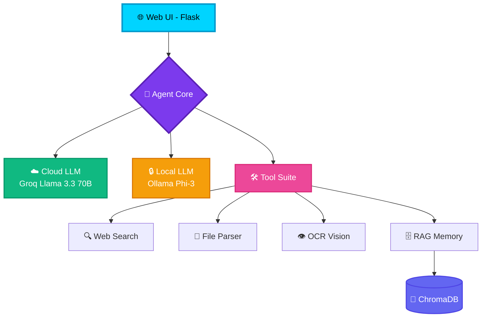

<div align="center">

<!-- Animated Banner -->


<!-- Badges -->
<p align="center">
  
  
  
  
</p>


<p align="center">
  <a href="https://koushikhy.netlify.app">
    
  </a>
</p>

## 🌐 Live Demo

[](https://huggingface.co/spaces/koushik4475/openagent)

</div>

---

## 🌟 **What is OpenAgent?**

<div align="center">

```ascii
╔═══════════════════════════════════════════════════════════════╗
║                                                               ║
║   🧠 HYBRID AI AGENT - Best of Both Worlds                   ║
║                                                               ║
║   ⚡ ONLINE  → Groq Llama 3.3 70B (ChatGPT-level, FREE)     ║
║   🔒 OFFLINE → Ollama Phi-3 (Privacy + Local Processing)     ║
║   🎯 AUTO    → Intelligent Switching Based on Connectivity   ║
║                                                               ║
╚═══════════════════════════════════════════════════════════════╝
```

</div>

> A **next-generation AI assistant** that combines the **privacy of local processing** with the **power of cloud intelligence**. Never compromise between speed and security again!

---

## ✨ **Key Highlights**

<table>
<tr>
<td width="50%">

### 🎨 **Stunning Cyberpunk UI**
- ⚡ **Particle Animations** - Dynamic background effects
- 📺 **CRT Scanlines** - Retro-futuristic aesthetic
- 🌈 **Glassmorphism** - Modern blur effects
- 🎭 **Real-Time Status** - Visual mode indicators
- 📤 **Drag & Drop** - Seamless file uploads

</td>
<td width="50%">

### 🛠️ **Powerful Toolset**
- 🌐 **Web Search & Fetch** - Real-time internet access
- 📄 **File Parser** - PDF, DOCX, TXT extraction
- 👁️ **OCR Vision** - Image text recognition
- 🧠 **RAG Memory** - Conversation history
- ⚙️ **Sandbox Exec** - Safe command execution

</td>
</tr>
</table>

---

## 🚀 **Quick Start**

<details open>
<summary><b>📋 Prerequisites</b></summary>
<br>

```bash
✅ Python 3.10 or higher
✅ Ollama (for local AI models)
✅ Tesseract OCR (for image processing)
```

</details>

<details open>
<summary><b>🔑 API Setup (FREE — No Credit Card Needed)</b></summary>
<br>

1. Go to **[https://console.groq.com](https://console.groq.com)**
2. Sign up with Google or email
3. Navigate to **API Keys** → Click **Create API Key**
4. Copy the key (starts with `gsk_...`)

```yaml
llm:
  provider: "groq"
  api_key: "gsk_YOUR_API_KEY_HERE"
  base_url: "https://api.groq.com/openai/v1"
  cloud_model: "llama-3.3-70b-versatile"
  host: "http://localhost:11434"
  model: "phi3:mini"
```

</details>

<details open>
<summary><b>🎯 Launch the Agent</b></summary>
<br>

```bash
python ui/server.py
```

**🌐 Open your browser:** [`http://localhost:5000`](http://localhost:5000)

</details>

---

## 🏗️ **System Architecture**

<div align="center">



</div>

---

## 🎯 **Core Features**

| 🔧 Tool | 🌍 Type | 📝 Description |
|:---|:---:|:---|
| **Web Search** | 🌐 Online | DuckDuckGo-powered intelligent search |
| **Web Fetch** | 🌐 Online | Extract and parse website content |
| **File Parser** | 🔒 Local | PDF, DOCX, TXT text extraction |
| **OCR Vision** | 🔒 Local | Tesseract-based image text recognition |
| **Summarizer** | 🔒 Local | Condense long documents intelligently |
| **Sandbox Exec** | 🔒 Local | Secure shell command execution |
| **RAG Memory** | 🔒 Local | ChromaDB-powered conversation memory |

---

## 🎨 **UI Preview**

<div align="center">

</div>

---

## 👨‍💻 **About the Developer**

<div align="center">

### **Koushik HY**

[](https://koushikhy.netlify.app)
[](mailto:koushik4475@gmail.com)
[](https://github.com/koushik4475)

</div>

---

## 📜 **License**

MIT License — Copyright (c) 2024 Koushik HY

---

<div align="center">

**Made with ❤️ and ☕ by Koushik HY**


</div>
